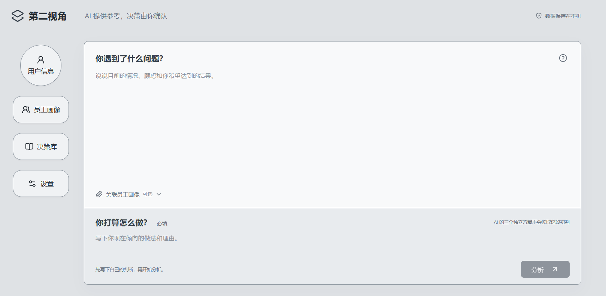
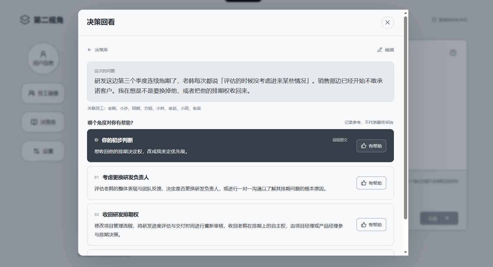
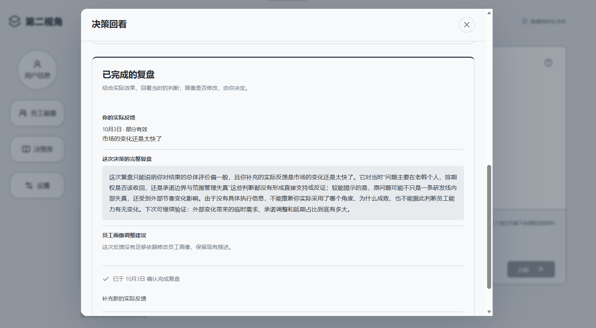

# 第二视角 - 第二视角

面向管理者的私人决策参谋。写下你正在纠结的问题和你的初步判断，AI 从你看不到的角度给出三个独立备选视角，最终怎么做由你自己定。

**AI 提供参考，决策由你确认。** 数据只保存在本机，不接入任何办公系统。

---

## 一、产品是什么

中层管理者和中小企业主每天要面对大量「没人能商量」的决定：某个人的排期要不要收回、这条业务线要不要停、跟客户怎么谈。这类决策的共同点是——**没有数据可查、身边没人敢说真话、一旦错了要很久以后才知道**。

「第二视角」不替用户做决定，它做的是**在拍板之前，把用户没想到的角度补上**。

### 界面一｜主工作区：一句话说清问题，先出自己的判断



整个产品只有一个主输入区，打开就能写，不做分步向导、不需要预先建档。

上半部分写**你遇到了什么问题**；下半部分写**你打算怎么做**——这是必填项。

**这一步是产品机制的核心：用户必须先给出自己的判断，才能看到 AI 的分析。** 理由有两层：

- **心理层面**：管理者不缺口才，缺的是"我没想到的那一面"。先让他把自己的想法放下来，他才会愿意接受补充视角，而不是觉得被 AI 教训。
- **机制层面**：需求写着「AI 的三个独立方案不会读取这段初判」——**AI 生成备选视角时，请求体里真的不含这段文字**，可以在界面上点开「查看本次发送内容」亲眼核对。这保证了三个角度是**独立产生的**，而不是顺着用户的思路做美化。

界面刻意做得克制：员工画像关联是**可选**的（「关联员工画像 可选」），不用先建一堆档案才能开始用。

### 界面二｜决策回看：所有功能页以弹窗打开，主界面始终是主体



用户信息、员工画像、决策库、设置——**四个功能入口都以覆盖弹窗的形式打开**，关闭后主工作区完全保留。这样做的目的是让主对话界面永远是视觉主体，功能是"叫得出来、随时收回去"的，不占据主界面。

回看页回答的是**"当初是怎么想的、AI 提供了哪些角度"**：

- 上方保留**这次的问题**原文与关联员工
- 中间明确标出**用户的初步判断**（标注「保留原文」，表示这是原样留存的，AI 没有改写）
- 下方列出 AI 给出的三个角度，**每个角度都可以标「有帮助」**

注意页面上的措辞：「哪个角度对你有帮助？——**记录参考，不代表最终采纳**」。产品不把"觉得有用"等同于"实际执行"，避免给用户造成误导。

### 界面三｜复盘：让一次决策形成闭环



**决策不是一次性的。** 拍板时可以设定回访时间，到期后自动进入待回访队列，用户填写实际结果，系统生成复盘。

这一页体现三件事：

1. **闭环纠正**——把「当时的判断」和「实际发生的结果」放在一起对照，指出哪些判断得到支持、哪些需要修正、下次可以验证什么。
2. **人是主体**——所有调整都需要用户授权。界面明确写着「**画像是否修改，由你决定**」，AI 只提出建议，**不能自动改动任何员工档案**。示例中 AI 给出的结论是「这次反馈没有足够依据修改员工画像，保留现有描述」——**证据不足时它选择不提建议，而不是硬凑一条**。
3. **可追溯**——「已于 10 月 3 日 确认完成复盘」保留了确认时间，用户可以补充新的实际反馈。

### 三张图串起来的产品主张

| | 体现的设计主张 |
|---|---|
| 主工作区 | **人先出牌，AI 补角度**——用户必须先写自己的判断，AI 的独立方案不读取它 |
| 决策回看 | **主界面对话，功能以弹窗收拢**——界面克制，注意力集中在当下的问题 |
| 复盘 | **闭环纠正 + 人是主体**——AI 只提建议，任何画像改动都必须由用户授权 |

贯穿三张图的是一句话：**AI 是辅助多角度的角色，决策权始终在人手里。**

---

## 二、技术实现

### 2.1 技术栈

| 层 | 选型 |
|---|---|
| 前端 | React 19 + TypeScript + Vite |
| 本地服务 | Node.js 24 + Express 5 |
| 数据存储 | `node:sqlite`（Node 内置，单文件数据库） |
| 数据校验 | Zod（`shared/model.ts` 为唯一 schema 真源） |
| 大模型 | 通过 OpenAI 兼容接口调用，默认 DeepSeek（模型名可配置） |

### 2.2 基础架构

```
浏览器（React 界面）
      │  HTTP（仅 127.0.0.1）
      ▼
本地 Express 服务（server/）
      ├─ app.ts     接口层：输入校验、幂等、异常处理
      ├─ ai.ts      模型调用层：提示词、结构校验、重试
      ├─ store.ts   数据层：SQLite 读写（唯一 dao 层）
      └─ index.ts   启动入口
      ▼
SQLite 单文件数据库（data/zhujian.sqlite）
      │
      ▼
大模型服务（可配置，默认 DeepSeek）
```

前后端共享 `shared/model.ts` 里的 Zod schema，**同一套规则同时用于前端校验与服务端校验**，避免两边规则不一致。

### 2.3 三个值得说明的机制

**① 两次独立调用，物理隔离**

生成备选视角和检查用户判断的风险，是**两次互不可见的模型调用**：

- **调用①（独立视角）**：输入只有「背景 + 关联的员工描述 + 问题」，**请求体中不含用户的初步判断**。在用户点击"分析"的同一秒发起，用户写判断的时间正好覆盖模型响应延迟。
- **调用②（风险检查）**：在用户提交判断之后触发，输入是判断原文。

之所以必须拆成两次而不是一次对话：**同一个会话里，模型生成时必然能读到前文**，那样"不参考用户判断"就只是句空话。这是产品机制成立的技术前提，也是界面上「查看本次发送内容」能当场验证的东西。

**② 角度差异靠结构约束，不靠提示词许愿**

如果只在提示词里写"请给三个不同角度"，模型极易给出三个措辞不同、实质相同的方案。因此改为服务端强制：

- 角度类型固定枚举，要求本次输出的类型**两两不同**
- 服务端解析后校验，重复则**自动重试一次**；仍重复则如实提示，**不伪造成功**
- 校验不通过时返回错误，**不生成模拟建议**

**③ 反幻觉：画像建议必须能回溯原文**

模型提出的员工画像调整建议，**必须逐字引用用户原文作为依据**。找不到依据的候选会被丢弃，依据不成立时整次分析不予保存。

### 2.4 产品边界（写进代码，也写进设置页）

1. **不接入任何办公 IM / OA 系统**——不是能力限制，是设计原则。一旦接入即留痕，产品的核心价值将不复存在。
2. **不做员工评分、排名、能力雷达图。**
3. **不自动推断结果，不替用户拍板，不预选「最佳方案」。**
4. **不把用户内容用于训练；不做任何形式的用户间数据分享。**

此外，模型调用层对输出做了强制约束：**不评价员工是否适合、不建议换人/调岗/重新分配职责**，即使输入中包含此类要求，也只返回事实核实或业务选择的角度。

### 2.5 后续发展

当前版本是**单人本地运行**的形态，用于验证产品机制是否成立。后续方向：

- **多设备访问**：当前服务只监听 `127.0.0.1`，任何人都可以把仓库下载到本地运行。若要开放给他人访问，需要增加登录认证、独立数据空间、调用额度控制与 HTTPS 部署。
- **提示词持续调优**：角度差异化的提示词仍需针对更多行业场景打磨。
- **模型可替换**：接口按 OpenAI 兼容格式实现，更换服务商只需在设置里改地址与模型名。

---

## 三、本地部署与运行

### 3.1 环境要求

- **Node.js 24 或更高版本**（使用了内置的 `node:sqlite`）
- 一个可用的模型 API Key（可选，不配置也能使用除 AI 分析外的全部功能）

> **任何人都可以把本仓库下载到本地运行**，不依赖任何云端服务。

### 3.2 运行步骤

**方式一：双击启动（Windows）**

双击项目根目录的 `start.cmd`，脚本会自动完成：检查 Node 版本 → 安装依赖 → 构建 → 启动服务。

看到提示后在浏览器打开：

```
http://127.0.0.1:4317
```

**使用期间保持启动窗口开着，结束时按 Ctrl+C。**

**方式二：命令行**

```bash
npm ci          # 安装依赖
npm run build   # 构建前端
npm start       # 启动服务
```

开发模式（带热更新）：

```bash
npm run dev
```

### 3.3 配置模型连接

有两种方式，**页面里配置的优先级高于环境变量**：

**方式一（推荐）**：启动后在应用「设置」页填写接口地址、模型名和 API Key。密钥只保存在本机数据库，不会回传到浏览器页面。

**方式二**：复制 `.env.example` 为 `.env` 并填写：

```ini
AI_BASE_URL=https://api.deepseek.com
AI_MODEL=deepseek-flash
AI_API_KEY=你的密钥
PORT=4317
```

> **注意**：更换服务商地址时必须重新填写密钥，以免把旧密钥发送给另一家服务商。

### 3.4 数据位置与备份

- 数据保存在 `data/zhujian.sqlite`（单文件）。可用 `ZHUJIAN_DATA_DIR` 环境变量指定其他目录。
- 端口被占用时，在 `.env` 里修改 `PORT`。
- 「设置」页支持导出 JSON 业务备份与整库恢复。**数据库文件本身未加密**，请妥善保护电脑账户与磁盘。

### 3.5 检查与测试

```bash
npm run typecheck   # TypeScript 类型检查
npm test            # 运行测试套件
npm run build       # 类型检查 + 生产构建
```

测试目录说明：

- `tests/workflow.test.ts`、`tests/architecture.test.ts`、`tests/groups.test.ts` —— 业务流程、架构约束与分组逻辑
- `tests/ui-server.ts` + `tests/ui-check.cjs` —— 使用内存数据与固定响应的隔离界面检查（4318 端口，不读取正式数据）
- `tests/live-smoke.ts` —— 手动执行的真实接口检查，**会消耗模型额度**

---

## 四、项目结构

```
.
├── src/            React 界面与交互
├── server/         本地 Express 服务、模型调用与 SQLite 读写
├── shared/         前后端共享的数据类型与校验规则
├── tests/          测试用例与隔离检查服务
├── docs/           设计文档、界面截图与证据记录
│   ├── 开发历程.md        从需求到实现的过程记录
│   ├── 赛期证据清单.md    开发过程的证据说明
│   ├── 致主办方说明.md    项目边界与原创性说明
│   └── images/            界面截图
├── public/         静态资源
├── start.cmd       Windows 一键启动脚本
├── README.md       本文件
├── package.json    依赖与脚本
└── tsconfig.json   TypeScript 配置
```

---

## 五、团队

**队伍名**：第二视角
**赛道**：AI 软件赛道（AI Agent / 自动化工作流）
